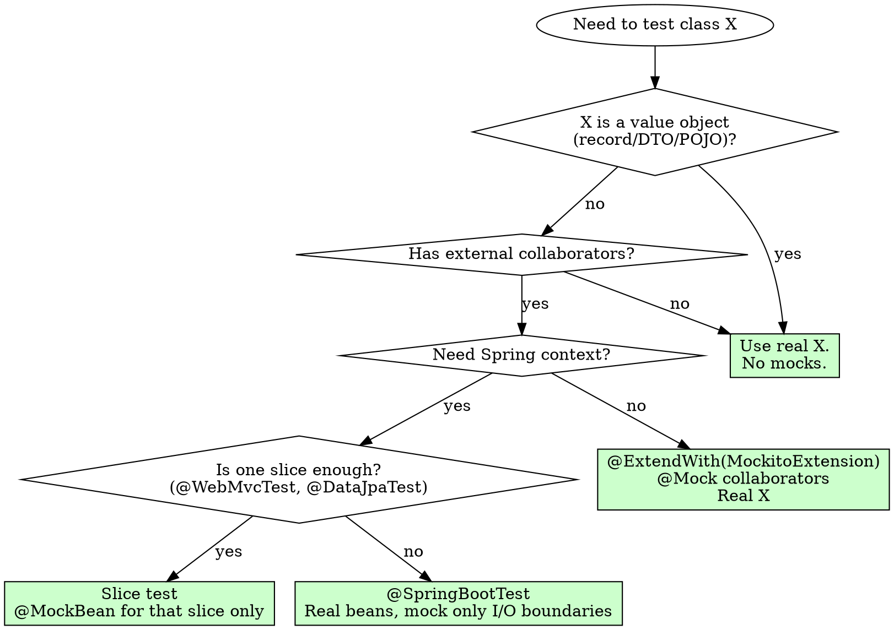

# Mockito Anti-Patterns (Java / Spring Boot)

**Load this reference when:** writing or changing tests in Java/Spring Boot projects, adding `@Mock` / `@MockBean` / `@SpyBean`, using `Mockito.when(...)`, or about to mock a class/method.

Java/Spring-specific companion to `testing-anti-patterns.md`. Same iron laws apply, plus the JVM/Spring-quirk extras below.

## Overview

Mockito makes mocking trivial; that's exactly why it's misused. Spring Boot adds a second layer of footguns through `@MockBean` / `@SpyBean` and the application-context cache.

**Core principle:** Real objects > pure unit tests with `@Mock` > slice tests > `@SpringBootTest` with `@MockBean`. Climb the ladder only when forced.

## The Iron Laws

```
1. NEVER verify mock interactions when you could assert on real outcomes
2. NEVER mock value objects (records, DTOs, POJOs)
3. NEVER let `any()` matchers dominate verifications
4. NEVER use @MockBean inside @SpringBootTest if a slice test or pure unit test would do
5. NEVER use RETURNS_DEEP_STUBS to fix a test — fix the production code
```

## Anti-Pattern 1: Verifying Mock Interactions Instead of Outcomes

**The violation:**
```java
// BAD — verifies the call happened, not that the right thing happened
@Test
void spawnsVehicle() {
    vehicleSpawner.spawn(roadId);
    verify(vehicleRepository).save(any(Vehicle.class));
}
```

**Why this is wrong:**
- Passes when `save()` is called with a half-constructed Vehicle.
- Doesn't catch wrong lane, wrong position, wrong IDM params.
- A refactor that switches from save-via-repo to save-via-event-bus breaks the test for the wrong reason.
- "It was called" ≠ "it did the right thing".

**The fix:**
```java
// GOOD — assert on the captured argument, or on returned state
@Test
void spawnsVehicleAtLaneZeroPositionZero() {
    ArgumentCaptor<Vehicle> captor = ArgumentCaptor.forClass(Vehicle.class);
    vehicleSpawner.spawn(roadId);
    verify(vehicleRepository).save(captor.capture());

    Vehicle v = captor.getValue();
    assertThat(v.getLane()).isEqualTo(0);
    assertThat(v.getPosition()).isEqualTo(0.0);
    assertThat(v.getIdmParams().v0()).isCloseTo(33.3, within(7.0));
}

// BETTER — don't mock the repository at all; use an in-memory variant.
//          Real domain logic + real persistence interface.
```

### Gate Function

```
BEFORE writing `verify(mock).method(...)`:
  Ask: "What outcome does this prove? Could I assert on the result/state instead?"

  IF result/state assertion is possible:
    PREFER it. Skip verify entirely.
  ELSE IF you must verify:
    USE ArgumentCaptor and assert on the argument.

  `verify(...)` alone is the weakest test signal.
```

## Anti-Pattern 2: Mocking Value Objects

**The violation:**
```java
// BAD — mocking a record / DTO / POJO
@Test
void calculatesAcceleration() {
    Vehicle v = mock(Vehicle.class);
    when(v.getSpeed()).thenReturn(15.0);
    when(v.getIdmParams()).thenReturn(mock(IdmParameters.class));
    when(v.getLane()).thenReturn(0);
    // ... 8 more when() lines
    double a = physicsEngine.computeAcceleration(v, leader);
    assertThat(a).isPositive();
}
```

**Why this is wrong:**
- `Vehicle` is a record / Lombok-generated POJO — it has no behavior to mock.
- Eight `when()` lines reproduce the constructor with worse readability.
- Misses real validation in the record (compact-constructor checks).
- Adding a field to `Vehicle` breaks every mock.

**The fix:**
```java
// GOOD — build the real object
@Test
void calculatesAcceleration() {
    Vehicle v = Vehicle.builder()
        .speed(15.0)
        .idmParams(IdmParameters.defaults())
        .lane(0)
        .position(100.0)
        .build();

    double a = physicsEngine.computeAcceleration(v, leader);
    assertThat(a).isPositive();
}
```

**Rule:** if the class has no `@Service`/`@Component`/`@Repository` semantics, **do not mock it.** Records, DTOs, mappers, validators, value objects → real instances every time.

## Anti-Pattern 3: `any()` Matchers Hiding Argument Bugs

**The violation:**
```java
// BAD — matches anything, including the wrong thing
verify(commandQueue).enqueue(any(SimulationCommand.class));
```

**Why this is wrong:**
- Passes if `enqueue(null)` is called.
- Passes if the wrong command type is enqueued.
- Passes if the right type with wrong fields is enqueued.
- Confirms the line was reached. Nothing more.

**The fix:**
```java
// GOOD — match on the actual command shape
verify(commandQueue).enqueue(eq(new StartCommand()));

// BETTER for complex args — capture and assert
ArgumentCaptor<SimulationCommand> cmd = ArgumentCaptor.forClass(SimulationCommand.class);
verify(commandQueue).enqueue(cmd.capture());

assertThat(cmd.getValue()).isInstanceOf(LoadConfigCommand.class);
LoadConfigCommand load = (LoadConfigCommand) cmd.getValue();
assertThat(load.mapId()).isEqualTo("highway-merge");
```

### Gate Function

```
BEFORE using `any()` in a *verification*:
  Ask: "Would this pass with the wrong argument?"

  IF yes → REPLACE with eq(...) or ArgumentCaptor.
```

`any()` is fine in *stubbing* (`when(repo.findById(any())).thenReturn(...)`); avoid it in *verification*.

## Anti-Pattern 4: `@MockBean` Bloat in `@SpringBootTest`

**The violation:**
```java
// BAD — every distinct @MockBean set rebuilds the ApplicationContext
@SpringBootTest
@Transactional
class SimulationControllerIT {
    @MockBean PhysicsEngine physicsEngine;
    @MockBean LaneChangeEngine laneChangeEngine;
    @MockBean SnapshotBuilder snapshotBuilder;

    @Autowired SimulationEngine engine;

    @Test void runsTick() { ... }
}
```

**Why this is wrong:**
- Each unique combination of `@MockBean` triggers a fresh `ApplicationContext` — context-cache miss, 5+ s startup penalty.
- 50 tests × 5 s = minutes of waste in `mvn test`.
- `@Transactional` rollback can be broken when MockBean replaces the bean that owns the transaction.
- Mocks bypass the very wiring the integration test was supposed to exercise.

**The fix:**
```java
// GOOD — unit-test physics in isolation; integration-test the real wiring
@ExtendWith(MockitoExtension.class)
class PhysicsEngineTest {
    @Mock IdmParameters params;
    @InjectMocks PhysicsEngine engine;
    // pure JUnit, no Spring context
}

@SpringBootTest // separate, no @MockBean, real beans
@Transactional
class SimulationControllerIT {
    @Autowired SimulationEngine engine;
    @Test void runsTickWithRealPhysics() { ... }
}
```

### Decision Table

| Scenario | Use |
|---|---|
| Pure logic / no Spring needed | `@ExtendWith(MockitoExtension.class)` + `@Mock` |
| Slice (controller only) | `@WebMvcTest` + `@MockBean` for the service the controller calls |
| Slice (JPA only) | `@DataJpaTest` (real H2, real entity manager) |
| Full integration | `@SpringBootTest` with NO `@MockBean` if at all possible |
| External I/O boundary (HTTP, message bus, subprocess) | `@MockBean` for that one collaborator only |

**Spring Boot 3.4+ note:** `@MockBean` is deprecated in favour of `@MockitoBean`. Same rules apply — the cost of a context restart is unchanged.

## Anti-Pattern 5: `RETURNS_DEEP_STUBS`

**The violation:**
```java
// BAD — chain-mocking to make the test compile
SimulationEngine engine = mock(SimulationEngine.class, RETURNS_DEEP_STUBS);
when(engine.getRoadNetwork().getRoad("R1").getLaneCount()).thenReturn(3);
```

**Why this is wrong:**
- Hides a Law-of-Demeter violation; the call site depends on three layers of internals.
- A null-check or refactor anywhere in the chain breaks the test silently.
- The fix belongs in the production code, not the test.

**The fix — fix the production code:**
```java
// Add a façade method on SimulationEngine
public int getLaneCount(String roadId) {
    return roadNetwork.getRoad(roadId).getLaneCount();
}

// Test cleanly
when(engine.getLaneCount("R1")).thenReturn(3);
```

If reaching deep into a graph is essential to the test, build the real graph instead of mocking it.

## Anti-Pattern 6: `when().thenReturn(null)` Instead of the Real Contract

**The violation:**
```java
// BAD — stubbing a null return that the production code never expected
when(roadRepository.findById("R1")).thenReturn(null);

assertThrows(NullPointerException.class, () -> vehicleSpawner.spawn("R1"));
```

**Why this is wrong:**
- Production likely returns `Optional<Road>` — your null violates the contract.
- The NPE you assert on is not a real production failure mode.
- The real bug (missing `Optional.empty()` handling) goes uncaught.

**The fix:**
```java
// GOOD — respect the real return type
when(roadRepository.findById("R1")).thenReturn(Optional.empty());

assertThatThrownBy(() -> vehicleSpawner.spawn("R1"))
    .isInstanceOf(RoadNotFoundException.class)
    .hasMessageContaining("R1");
```

If the method returns `Optional<T>` → stub `Optional.empty()` / `Optional.of(...)`. If it returns a primitive → stub the primitive. Never `null` unless null is part of the documented contract.

## Anti-Pattern 7: Forgotten `@ExtendWith(MockitoExtension.class)`

**The violation:**
```java
// BAD — @Mock fields are never initialized, NPE at runtime
class PhysicsEngineTest {
    @Mock IdmParameters params;
    @InjectMocks PhysicsEngine engine;

    @Test void test() { ... } // NullPointerException, mysterious to readers
}
```

**The fix:**
```java
@ExtendWith(MockitoExtension.class)
class PhysicsEngineTest {
    @Mock IdmParameters params;
    @InjectMocks PhysicsEngine engine;
}
```

Better yet — when feasible, drop `@Mock` entirely and pass a real `IdmParameters` to the constructor. Constructor injection > field injection > setter mocks.

## Anti-Pattern 8: Mocking `final` / `static` Without Asking Why

**The violation:**
```java
// BAD — reaching for mockito-inline to mock a static utility
try (MockedStatic<MapValidator> mocked = mockStatic(MapValidator.class)) {
    mocked.when(() -> MapValidator.validate(any())).thenReturn(ValidationResult.ok());
}
```

**Why this is a smell:**
- Static utility being hard to test means the call site is doing too much.
- `MockedStatic` mocks **leak across tests** if not closed in try-with-resources — verify every usage.
- Static utilities usually have no I/O — let them run for real.

**The fix — by case:**
- Static, pure computation → let it run, feed real input.
- Static doing I/O → it should not be static; refactor to an injected `@Component` and mock the bean.
- Static you cannot refactor → `mockito-inline` dependency, try-with-resources, isolate to a single test class.

## Anti-Pattern 9: `@SpyBean` Without Knowing the Cost

**The violation:**
```java
// Often overused — spying on a real Spring bean to mock one method
@SpringBootTest
class TickEmitterIT {
    @SpyBean StatePublisher statePublisher;

    @Test
    void emitsTick() {
        doNothing().when(statePublisher).publish(any());
        // ...
    }
}
```

**Why be careful:**
- `@SpyBean` wraps the real bean in a CGLIB proxy → breaks `final` methods, breaks `equals/hashCode` on records.
- Conflicts with `@Transactional` / `@Async` AOP proxies — the bean ends up double-proxied.
- Easy to leave `doNothing()` lingering across tests if `Mockito.reset()` isn't called.

**The fix — preferred order:**
1. Constructor-inject a test variant (`InMemoryStatePublisher`) via `@TestConfiguration`.
2. Switch to a slice test (`@WebMvcTest`) where `@MockBean` is cheap and clean.
3. Use `@SpyBean` only when you need partial real behavior with one stubbed method, AND there is no AOP on the target.

## Decision Tree



## Project-Specific Notes (Traffic Simulator)

- `PhysicsEngine`, `LaneChangeEngine`, `IntersectionManager`, `MapValidator` — pure logic. NEVER `@SpringBootTest`. Use `@ExtendWith(MockitoExtension.class)` or no Mockito at all.
- `MapConfig`, `MapConfig.LaneConfig`, `RoadDto`, `VehicleDto`, `SimulationStateDto` — records / value objects. Build real instances; no mocking.
- `OsmConverter` implementations (`OsmPipelineService`, `GraphHopperOsmService`, `Osm2StreetsService`) — mock the *external client* (Overpass HTTP, subprocess `ProcessBuilder`), not the converter itself. Use canned XML/JSON fixtures from `src/test/resources/`.
- `VisionController` / `OsmController` — slice tests with `@WebMvcTest`; `@MockBean` only for the service layer.
- `SimulationEngine` integration tests → `@SpringBootTest` with NO `@MockBean`. Real wiring is the value being tested.
